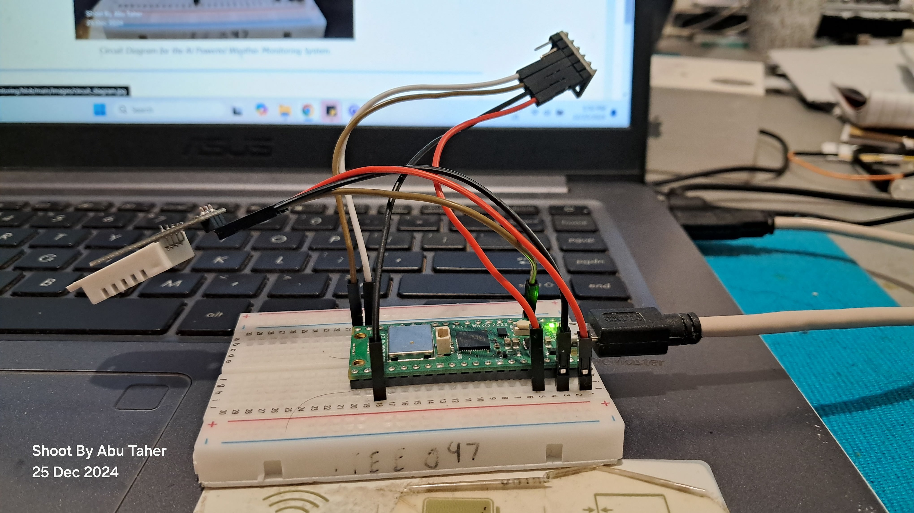
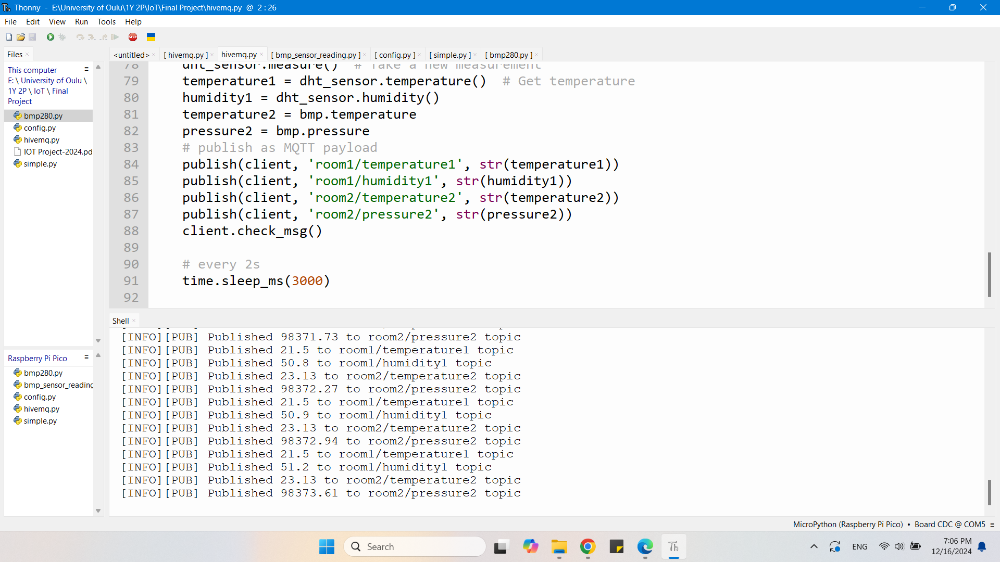
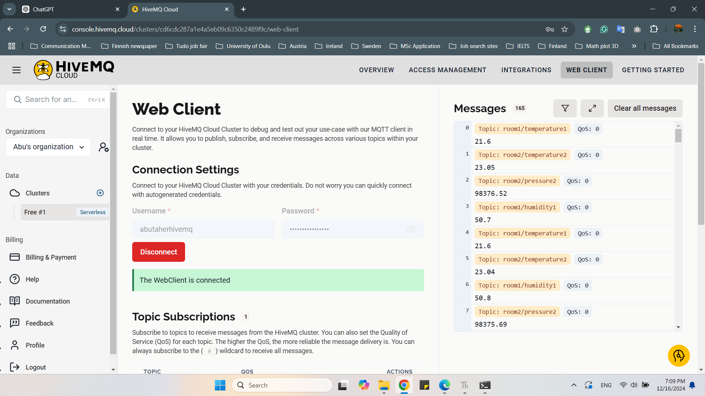
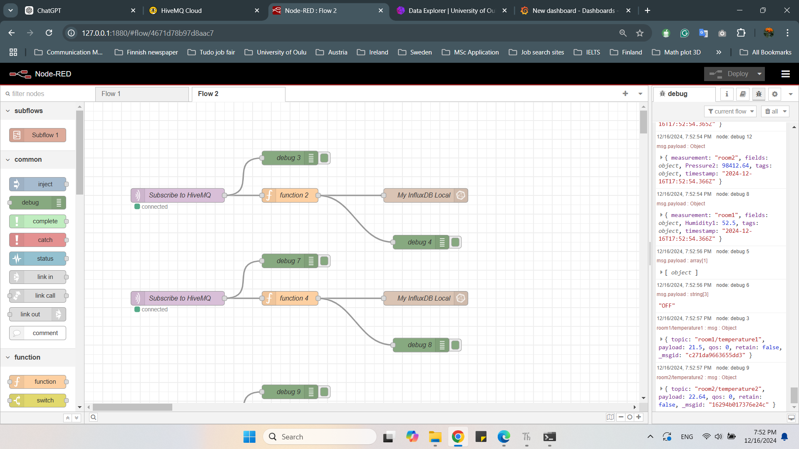
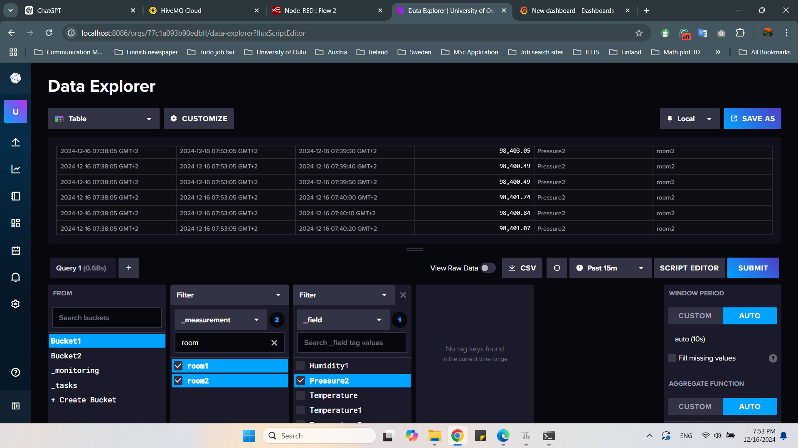
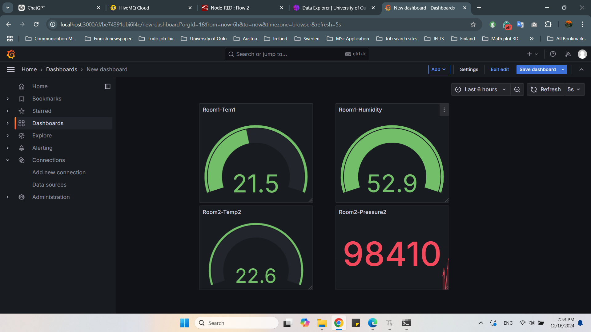
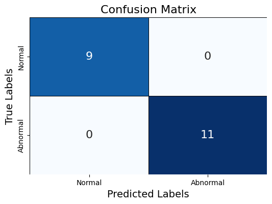
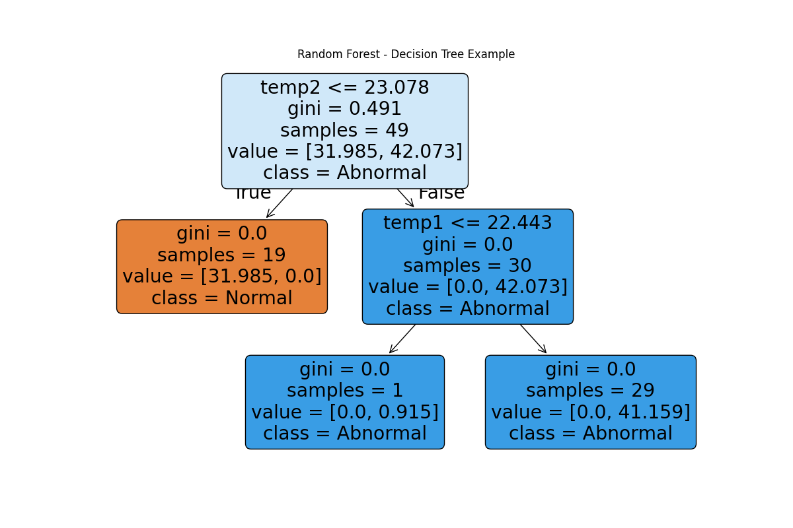
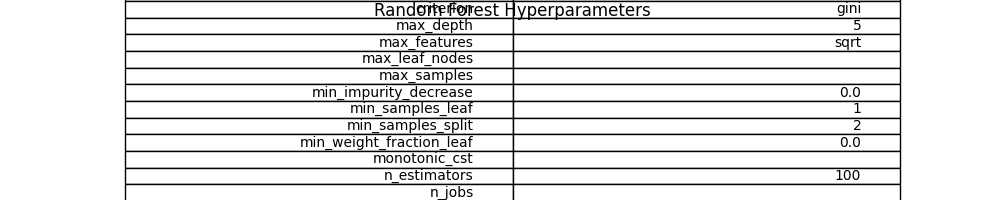
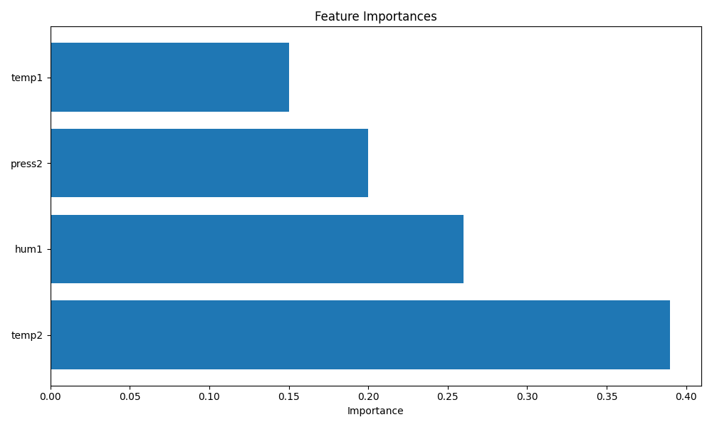

# AI Powered Weather Monitoring 🌤️🤖

## Overview 📊
This repository contains the implementation of an AI-powered weather monitoring system using Raspberry Pi Pico W. It includes real-time data sensing, processing, and visualization pipelines, integrating IoT and AI/ML for advanced analytics and anomaly detection. 🌍📡

---

## Pipeline 🛠️🔄

  
  
<i>Figure 1: Weather Monitoring System Pipeline</i>

---

## Circuit Diagram 📡🔌

  
  
<i>Figure 2: Circuit Diagram for the AI-Powered Weather Monitoring System.</i>

  
  
<i>Figure 3: Pin Configuration of AI-Powered Weather Monitoring System. </i>

---

## 🎬 YouTube Video Demo

  
  
<I>Click on the thumbnails or https://youtu.be/hyS4sfDcfvg?si=e11aTrE80sh_ykmr to watch the AI Powered Weather Monitoring demo on YouTube. </i>

---

## How to Use This Repository 🛠️📖

### Prerequisites 📝
Before using this repository, you should be familiar with:
- Reading sensor data with Raspberry Pi Pico W 🧑‍💻
- Setting up Wi-Fi, HiveMQ, Node-RED, InfluxDB, Grafana, and Google Colab 🌐
- Implementing AI/ML models like SVM, Random Forest, and K-Means Clustering 🧠

If you are new to any of these, [Follow this link](https://github.com/Abu-Taher-web/Internet_of_Things_all_Exercise_code) for step-by-step exercises. You can learn these concepts in approximately two days. ⏳

### Instructions 📜

#### 1. Setting Up Raspberry Pi Pico W 🖥️
1. **Download Thonny**: Install the Thonny IDE from Thonny's website.
2. **Connect Pico W**:
   - Press and hold the BOOTSEL button on your Pico W.
   - Connect it to your computer while keeping the button pressed.
   - Your Pico W should appear as USB storage. 💾
3. **Install Firmware**:
   - Download this repository to your PC.
   - Navigate to the `Firmware` directory and locate `RPI_PICO_W-20231005-v1.21.0.uf2`.
   - Copy and paste it onto your Pico W.
   - Disconnect and reconnect your Pico W. 🔄
4. **Setup Thonny**:
   - Restart Thonny. If connected properly, the console should display the help() message. ✅

#### 2. Deploying Code 📂
1. Navigate to the `Code for Pico W` folder.
2. Open each `.py` file in Thonny.
3. Save each file directly to your Pico W by selecting **File > Save As** and choosing the Pico W device. 💻

#### 3. Running HiveMQ 🌐
1. Locate the `hivemq_v3.py` file.
2. Run the file in Thonny.
3. The console will display real-time sensor data. 📈

  
  
<i>Figure 4: Console Data From Thonny</i>

#### 4. Visualizing Data 📊

1. **HiveMQ**: Log in to your HiveMQ dashboard to verify incoming data.
   - **Security**: Utilized SSL/TLS protocols to encrypt data 🔐.
   - **Incoming Data**: HiveMQ dashboard displaying data in real-time. 🕹️

  
  
<i>Figure 5: HiveMQ Messages</i>

2. **Node-RED**: Check the debug window for data in JSON format. 📡

  
  
<i>Figure 6: Node-RED Flows</i>

6. **InfluxDB**: View incoming data in the InfluxDB instance. 📊

  
  
<i>Figure 7: InfluxDB Time Series Database</i>

7. **Grafana**:
   - Configure the dashboard using queries generated by InfluxDB.
   - Set up email alerts for abnormal conditions. 📩

  
  
<i>Figure 8: Grafana Dashboard</i>

#### 5. Running the AI Model 🤖
1. Navigate to the `Code For Colab` folder.
2. Upload the model and `.ipynb` file to Google Colab.
3. Provide your credentials and run the notebook. 🧑‍💻
4. The Random Forest model will classify data in real-time as `normal` or `abnormal`. 📉

---

## Machine Learning Model 🧠

### Data Collection 📊
- **Normal Data**: Recorded at room temperature 🌡️.
- **Abnormal Data**: Recorded while blowing air on the sensor 💨.

| Data Type      | Training Split | Testing Split |
|----------------|----------------|---------------|
| Normal Data    | 80%            | 20%           |
| Abnormal Data  | 80%            | 20%           |

### Training and Testing 🧑‍🏫

1. Merged normal and abnormal datasets to create `X_train` and `X_test`.
2. Tested multiple models:
   - K-Means Clustering
   - Isolation Forest
   - Random Forest (Best Performance) 🏆

3. **Random Forest Results**:
   - **Accuracy**: 100% on the test dataset. ✅
   - **Evaluation Metrics**:
   - **Confusion Matrix**:

  
  
<i>Figure 9: Confusion Matrix</i>

   - **Classification Report**:

|              | Precision | Recall | F1-Score | Support |
|--------------|-----------|--------|----------|---------|
| **0 (normal)** | 1.00      | 1.00   | 1.00     | 9       |
| **1 (abnormal)** | 1.00      | 1.00   | 1.00     | 11      |
| **Accuracy** |           |        | 1.00     | 20      |
| **Macro Avg** | 1.00      | 1.00   | 1.00     | 20      |
| **Weighted Avg** | 1.00  | 1.00   | 1.00     | 20      |

### Model Features 🔧
- Architecture 🏗️

  
  
<i>Figure 10: Decision Tree Architecture</i>

- Hyperparameters ⚙️

  
  
<i>Figure 11: Hyperparameters Table</i>

- Most Important Features 🔑

  
  
<i>Figure 12: Feature Importances</i>

---

🚀 **Announcement:** Edge AI implementation using C/C++ is coming! 
