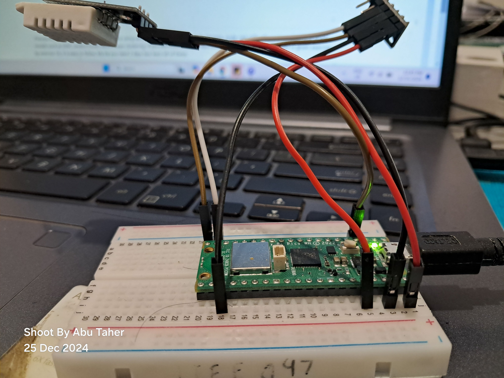

# AI Powered Weather Monitoring

## Overview
This repository contains the implementation of an AI-powered weather monitoring system using Raspberry Pi Pico W. It includes real-time data sensing, processing, and visualization pipelines, integrating IoT and AI/ML for advanced analytics and anomaly detection.

---

## Circuit Diagram

---

## Pipeline

---

## YouTube Video Demo

---

## How to Use This Repository

### Prerequisites
Before using this repository, you should be familiar with:
- Reading sensor data with Raspberry Pi Pico W
- Setting up Wi-Fi, HiveMQ, Node-RED, InfluxDB, Grafana, and Google Colab
- Implementing AI/ML models like SVM, Random Forest, and K-Means Clustering

If you are new to any of these, [Follow this link](https://github.com/Abu-Taher-web/Internet_of_Things_all_Exercise_code.git) for step-by-step exercises. You can learn these concepts in approximately two days.

### Instructions

#### 1. Setting Up Raspberry Pi Pico W
1. **Download Thonny**: Install the Thonny IDE from [Thonny's website](https://thonny.org/).
2. **Connect Pico W**:
   - Press and hold the BOOTSEL button on your Pico W.
   - Connect it to your computer while keeping the button pressed.
   - Your Pico W should appear as USB storage.
3. **Install Firmware**:
   - Download this repository to your PC.
   - Navigate to the `Firmware` directory and locate `RPI_PICO_W-20231005-v1.21.0.uf2`.
   - Copy and paste it onto your Pico W.
   - Disconnect and reconnect your Pico W.
4. **Setup Thonny**:
   - Restart Thonny. If connected properly, the console should display the help() message. 

#### 2. Deploying Code
1. Navigate to the `Code for Pico W` folder.
2. Open each `.py` file in Thonny.
3. Save each file directly to your Pico W by selecting **File > Save As** and choosing the Pico W device. 

#### 3. Running HiveMQ
1. Locate the `hivemq_v3.py` file.
2. Run the file in Thonny.
3. The console will display real-time sensor data.

#### 4. Visualizing Data
1. **HiveMQ**: Log in to your HiveMQ dashboard to verify incoming data. 
2. **Node-RED**: Check the debug window for data in JSON format. 
3. **InfluxDB**: View incoming data in the InfluxDB instance. 
4. **Grafana**:
   - Configure the dashboard using queries generated by InfluxDB.
   - Set up email alerts for abnormal conditions. 

#### 5. Running the AI Model
1. Navigate to the `Code For Colab` folder.
2. Upload the model and `.ipynb` file to Google Colab.
3. Provide your credentials and run the notebook.
4. The Random Forest model will classify data in real-time as `normal` or `abnormal`.

---

## Machine Learning Model

### Data Collection
- **Normal Data**: Recorded at room temperature.
- **Abnormal Data**: Recorded while blowing air on the sensor.

| Data Type      | Training Split | Testing Split |
|----------------|----------------|---------------|
| Normal Data    | 80%            | 20%           |
| Abnormal Data  | 80%            | 20%           |

### Training and Testing
1. Merged normal and abnormal datasets to create `X_train` and `X_test`.
2. Tested multiple models:
   - K-Means Clustering
   - Isolation Forest
   - Random Forest (Best Performance)
3. **Random Forest Results**:
   - **Accuracy**: 100% on the test dataset.
   - **Evaluation Metrics**:  

### Model Features
- Architecture

- Hyperparameters

- Most Important Features

---

## HiveMQ

- **Security**: Utilized SSL/TLS protocols to encrypt data.
- **Incoming Data**: HiveMQ dashboard displaying data in real-time. 

---

## Node-RED

- **Configuration**: Detailed node configurations.

---

## InfluxDB

- **Visualization**: Real-time data displayed in the InfluxDB dashboard.

---

## Grafana

- **Dashboard**: Custom dashboards for weather monitoring.
- **Alerts**: Email notifications for anomalies.

